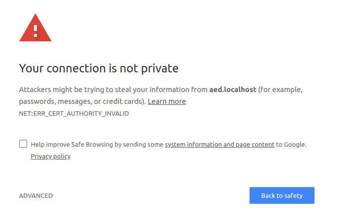
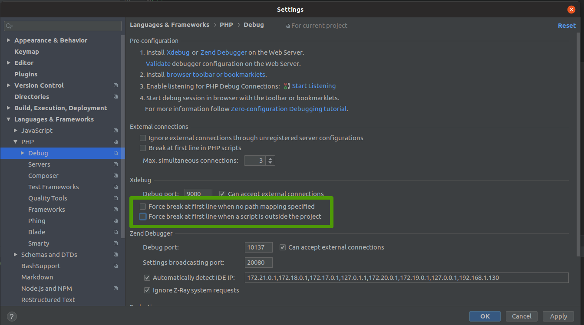

# I can't connect to the DB as I was doing it on my localhost
Since the DB it's a independent container, the right way to connect to it is point to the remote container like this:

```
'database' => '[DB_NAME]',
'username' => '[DB_USER]',
'password' => '[DB_PASSWORD]',
'host' => '[PROJECTNAME]_[DB_HOST]',
```
Basically we are using the configured db params at `.docker.env`. For example if we have a .docker.env configured like this: 

```
...

PROJECTNAME=foo

DB_NAME=db
DB_USER=db
DB_PASSWORD=db
DB_ROOT_PASSWORD=root
DB_HOST=mariadb
DB_DRIVER=mysql

....
```

We should connect from our web project using this config:
```
'database' => 'db',
'username' => 'db',
'password' => 'db',
'host' => 'foo_mariadb',
```

# Chrome shows me "Your connection is not private" when I try to enter to the https dockerized page.

Since dockerizer provides a self signed certificate to allow https localhost development, iy's common to see a warning link this:

[](img/your-connection-is-not-private.png)

The solution at chrome is to open a new tab and paste this command: `chrome://flags/#allow-insecure-localhost` mark the option to "enabled" and restart the browser:

[ ](img/conf-chrome-allow-https-self-signed.png)

Now chrome will show the page without prompting you with "Your connection is not private" anymore.

# I want PhpStorm stop debugging drush!

Just disable those options at your PhpStorm settings and you are done.

[](img/drush-disable-xdebug-phpstorm.png) 


# How can I debug drush scripts in drupal 8?

Due to drupal-launcher loses it's mind when you are trying to debug a script. You need to bypass it calling directly the real drush command like this:

`cmd php ./vendor/drush/drush/drush foo:command` 

